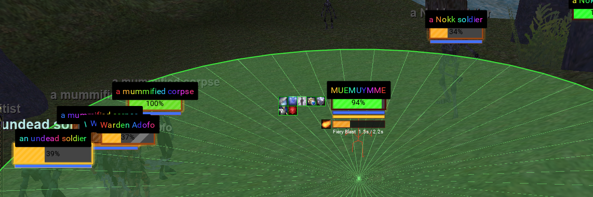
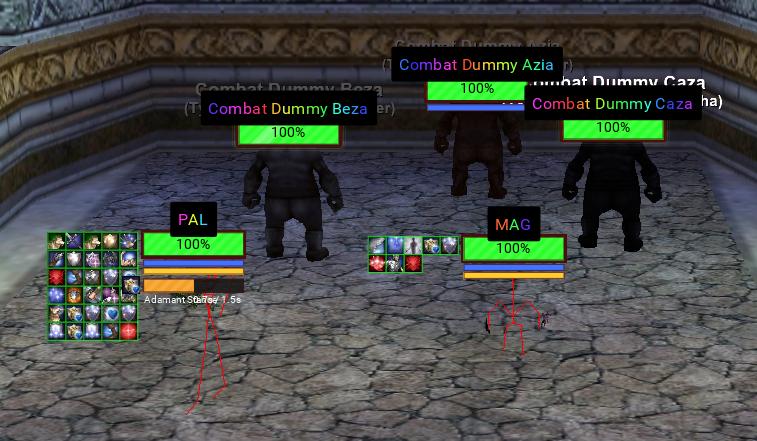
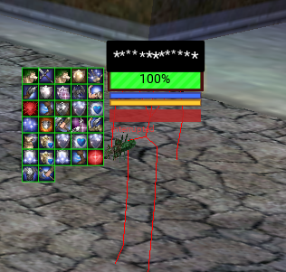
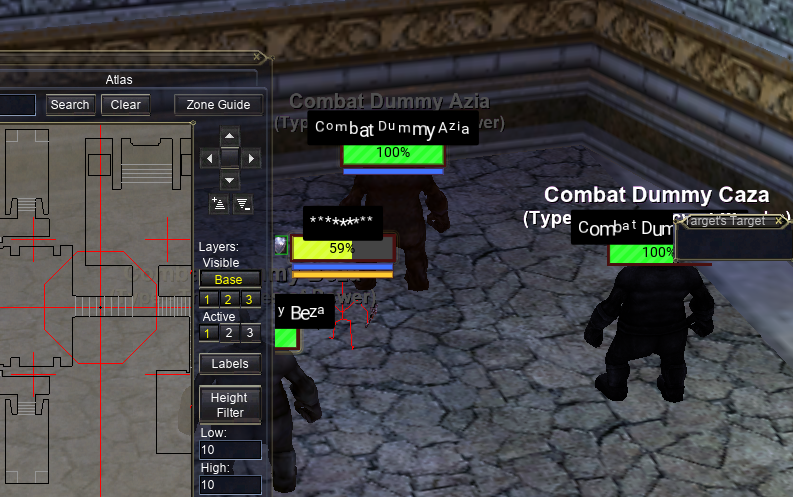
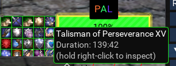
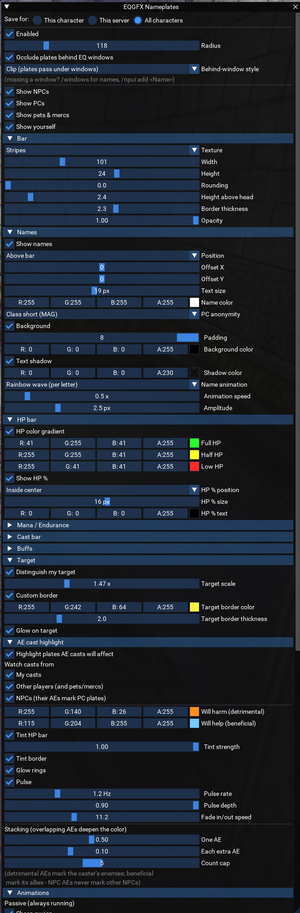
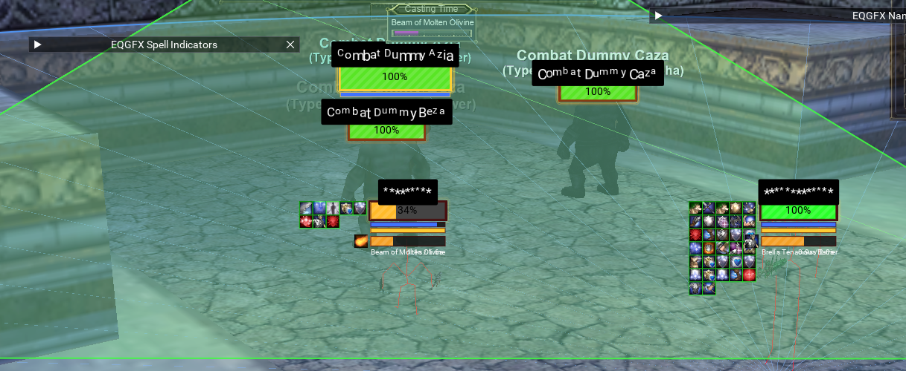
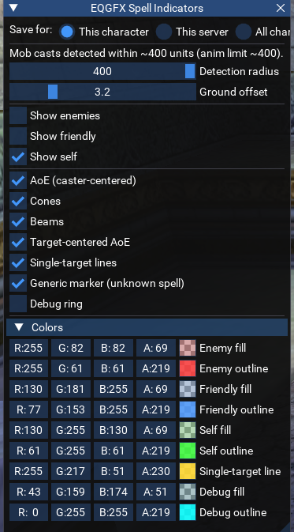

EQGFX - Render Lua Inside of EQ

Use Lua to render things inside of the game

Includes the native EQGFX Library to interact with the game, as well as a nameplates example & casting AE Example.



Notes: a lot of this code was written using Claude Fable. The included DLL was compiled using [WINE-MSVC](https://github.com/mstorsjo/msvc-wine) on Linux so it should work on Windows, but YMMV. The C++ source code is included, as well as the linux build script. 

# eqgfx/nameplates

## Animated Nameplates with Casting Events

 

See enemy and friendly nameplates from within EQ. Shows HP, MP, Endurance, spells, buffs, indicators if they are within AEs, casting and interrupts. 

## Native UI Occlusion



Hides behind your native EQ Windows

## Hover Over Buffs for Information

Get buff information by hovering the buffs. Uses cached buffs so you don't have to keep a mob targeted.



## Completely Customizable



Customize just about every aspect!

## Commands

| Command | What it does |
|---------|--------------|
| `/npmenu` | Toggle the settings window. Every widget applies live and auto-saves. |
| `/npradius N` | Set the plate range filter (world units). Same as the Radius slider. |
| `/nppcs` | Quick-toggle plates for other players. |
| `/npdebug` | Print a health report to the MQ console / log (see below). |
| `/npui` | List the EQ windows the native occlusion scan currently sees, with their rects. |
| `/npui show` | Toggle an on-screen overlay outlining every detected occluder rect with its window name. |
| `/npui add <Name>` | Track an extra window name for occlusion (find names with `/windows`). Persisted in settings. |


## DocTyped

Need to make edits? Everything is typed and annotated so you can easily find the functions and fields that you are looking for.

# eqgfx/indicators



See your AEs, friendly AEs, and enemy AEs as they are being cast. Uses EQBC to communicate with other boxes to figure out the target of spawn AE casts. (if they happen to have the casting mob targeted, not always accurate on mob casting & the targets of those mobs)

## Customizable



## Commands

| Command | What it does |
|---------|--------------|
| `/aemenu` | Toggle the settings window. |
| `/aering [r]` | Toggle a fixed debug ring of radius `r` around you (calibration aid). |
| `/aerad r` | Change the debug ring radius. |
| `/aez z` | Ground offset: how far below a spawn's reported Z to draw areas (fixes floating/buried rings on uneven ground). |


# EQGFX Native Lib

Native DLL & Lua FFI script to interact with the EQ Rendering Engine. Draw lines, grab spell geometry, get native UI window information, and more. 

```lua
local eqgfx = require('eqgfx')
eqgfx.init()                                  -- wire up render callback + camera

-- per frame / pulse:
eqgfx.clear()
local sx, sy, vis = eqgfx.world_to_screen(x, y, z)      -- world -> screen pixels

-- world-space primitives (projected + drawn by the engine each frame):
eqgfx.add_circle(x, y, z, radius, color, segments)
eqgfx.add_arc(cx, cy, cz, radius, startRad, endRad, color, segments)
eqgfx.add_line(x1,y1,z1, x2,y2,z2, color)

-- screen-space primitives (pixels, no projection):
eqgfx.add_screen_line(x1,y1, x2,y2, color)
eqgfx.add_screen_rect(x0,y0, x1,y1, color)

-- spell geometry (targetType / range / aeRange / coneStart / coneEnd):
local geom = eqgfx.spell_geom(spellID)

eqgfx.set_thickness(px)                       -- world-line half-width
eqgfx.argb(a,r,g,b)                           -- color for eqgfx primitives
eqgfx.shutdown()
```
For nameplate-style ImGui drawing, use `eqgfx.world_to_screen` for the position and draw with MQ's ImGui (`ImGui.GetForegroundDrawList()`), as `nameplates/` does.
