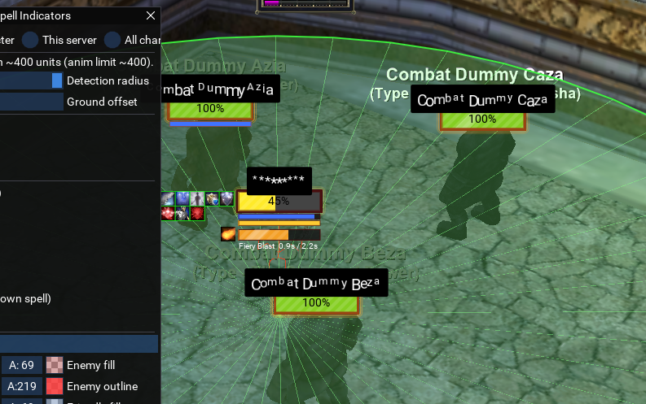

# Getting started

eqgfx draws in the EverQuest 3D world from MacroQuest Lua — animated
nameplates and on-the-ground spell area indicators, rendered by the game's
own engine. This guide takes you from a fresh download to both features
running and customized.

---

## Requirements

- **MacroQuest** on the **DirectX 11** EverQuest client, using a standard
  (non-static) MQ build so `eqlib.dll` exports its symbols.
- Nothing else. The prebuilt `native/eqgfx.dll` ships with the repo and
  configures itself from your MacroQuest install at runtime — there is
  nothing game-version-specific to set up.
- Building the DLL yourself is **optional** and only needed if you change the
  C++ side (see [DEVELOPING.md](DEVELOPING.md)). It works on Linux/Wine via
  msvc-wine — that's the environment eqgfx was built for.

## Install

Drop the whole folder into your MacroQuest `lua/` directory:

```
<MacroQuest>/lua/eqgfx/{init.lua, core/, native/, nameplates/, indicators/, ...}
```

The module finds `native/eqgfx.dll` relative to itself; there is nothing to
configure.

## Run

```
/lua run eqgfx/nameplates      nameplates + /npmenu settings window
/lua run eqgfx/indicators      AE area indicators + /aemenu settings window
```

Both can run at the same time. Stop them with `/lua stop eqgfx/nameplates`
and `/lua stop eqgfx/indicators`.

---

## Nameplates tour


Every nearby spawn (NPCs, PCs, pets/mercs, optionally yourself — each
toggleable) gets a plate that tracks it frame-accurately:

- **HP bar** with a low→mid→high color gradient (or a fixed color), five
  fill textures (Flat / Gradient / Glass / Stripes / Segmented), optional
  HP % text, and thin mana/endurance bars underneath for the spawns you
  choose (self / group / all PCs / everything).
- **Name text** above, below or inside the bar, with optional shadow,
  background, per-letter animations (wave, bounce, rainbow, typewriter, ...)
  and PC-name anonymization (class name, scramble, asterisks, first+last) —
  handy for streaming.
- **Cast bar** under the plate while the spawn casts: spell icon, name, time
  remaining, and interrupt detection. Your own casts come from the client;
  other spawns' casts are detected from the "begins to cast" chat line.
- **Buff icons** in configurable rows per side (beneficial/detrimental),
  with filters, per-buff size/priority overrides, borders by type or by
  caster, hover tooltips, and right-click spell inspection.
- **Target styling** — your current target's plate can scale up and get its
  own border color and glow.
- **Animations** everywhere, all optional: fade in/out, damage flash, appear
  pop, HP smoothing, sheen sweeps, low-HP heartbeat, breathing, border glow,
  idle bob. Per-plate phase offsets keep a crowd from pulsing in lockstep.

Open `/npmenu` and play — every widget applies instantly and saves
automatically.

### Native UI occlusion

Plates never draw over the EverQuest windows. By default they are **clipped**
around every open EQ window (the plate visually slides underneath); you can
switch to hiding the whole plate instead ("Behind-window style" in `/npmenu`).
If some custom window isn't being detected, see `/npui` in
[COMMANDS.md](COMMANDS.md).


### AE cast highlight

While an area spell is being cast — by **you**, **another player** (or their
pet/merc), or an **NPC** — the plates of everyone the cast will affect light
up:

- **Orange** (`Will harm`): detrimental AEs mark the caster's *enemies*. Your
  PBAE marks the NPCs in range; an NPC's AE marks the PCs standing in it —
  including you. NPC AEs never mark other NPCs.
- **Light blue** (`Will help`): beneficial AEs mark the caster's *allies* —
  a raidmate's group heal lights up the group members it will reach.

Overlapping AEs **stack**: one AE shows at 50% intensity, each additional one
adds 10%, capped at five. Colors, the stack curve, which sources to watch,
and the tint/border/glow/pulse styling are all in `/npmenu` under
"AE cast highlight".



The area shapes mirror what the indicators feature draws: caster-centered
rings, target-centered rings, cones and beams, taken from the spell's real
geometry. Two practical limits: a group-target spell from someone *outside*
your group marks nothing (their group roster isn't knowable), and a
target-centered AE from another caster resolves only while you have that
caster targeted.

---

## Indicators tour


While you or nearby spawns cast, the affected area is drawn on the ground:

- **PBAE / caster-centered** spells: a ring around the caster.
- **Targeted AE** spells: a ring around the victim.
- **Cones and beams**: the directional wedge/strip the spell covers.
- **Single-target** casts: a line from caster to target.

Colors are split by who is casting (you / friendly / enemy), each shape type
can be toggled, and the drawings are clipped around open EQ windows so they
stay under the native UI. With EQBC connected, boxes share resolved cast
targets so every client can draw target-centered rings even when it never
targeted the caster.

`/aemenu` opens the settings window.

---

## Settings and save scopes

Settings persist under `<MQ config>/eqgfx/` as plain Lua files:

| File | Scope |
|------|-------|
| `<Server>_<Name>_settings.lua` | one character (the default) |
| `<Server>_settings.lua` | every character on a server |
| `global_settings.lua` | everything |

Both features share these files (each under its own section), and each menu
has a "Save for: character / server / global" selector at the top. Picking a
broader scope migrates the section so it actually takes effect. Files are
written only when something changed.

---

## Troubleshooting

- **`/npdebug`** prints a full health report: render capabilities, the loaded
  DLL build stamp, the native UI scan state (`ui sweep`, `ui rects` lines),
  buff scan results for your target, and any AE areas currently in flight.
- **Plates draw over a window?** `/npui` lists every window the scan sees;
  `/npui show` draws the detected rects on screen. A window the client names
  unusually can be added with `/npui add <Name>` (find names with
  `/windows`).
- **"eqgfx.dll on disk is newer..." warning**: the game session loaded an
  older DLL build. Restart EQ once; after that, rebuilt DLLs hot-load on
  every `/lua run` without restarting.
- **No cast bars / indicators for other spawns**: cast detection rides on the
  "begins to cast" chat line — make sure those messages aren't filtered off.
